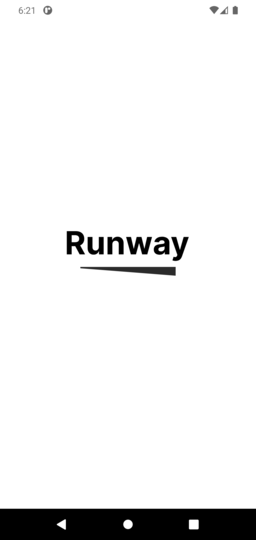
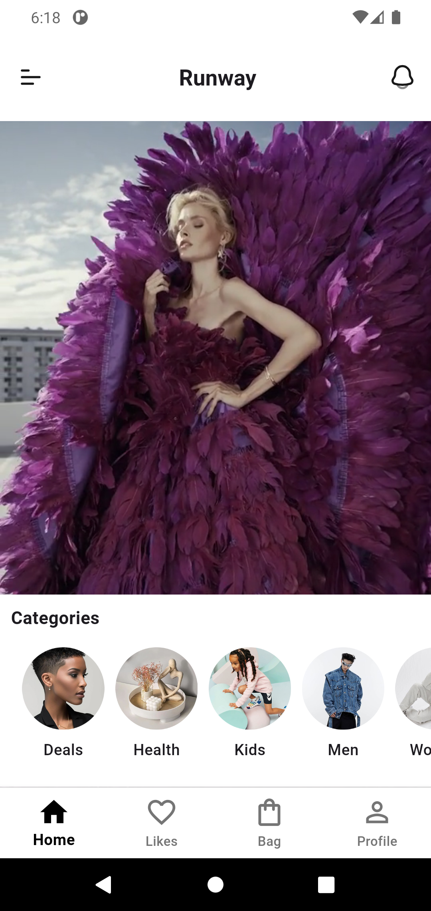
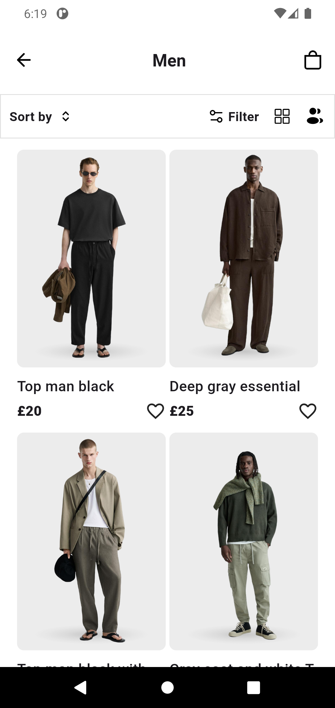
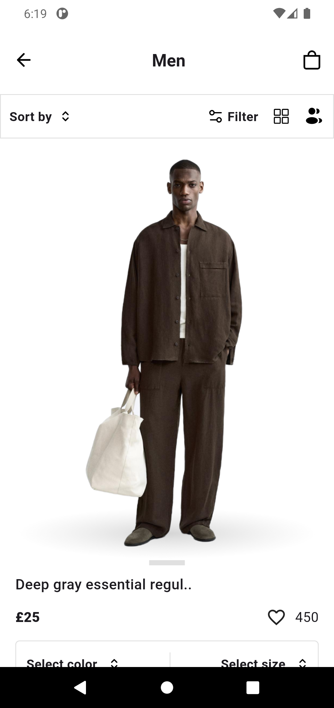
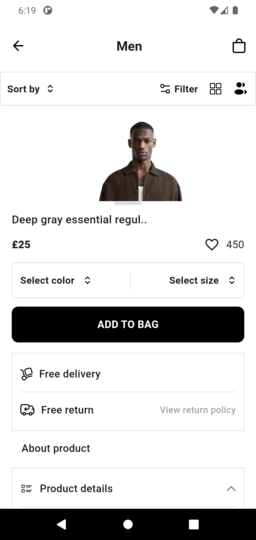

# 🛍️ Runway Fashion App

A modern, stylish mobile fashion store app built using **Flutter**. The app provides an elegant user experience with clean UI design, responsive layout, and smooth navigation — all tailored for showcasing fashion products.

## 📱 Features

- 🧥 **Product Showcase**: Display fashion items with image, price, and description.
- 🔍 **Bottom Navigation Bar**: Simple and intuitive tab-based navigation.

## Screenshots







## 📂 Project Structure

The app uses a clean structure for better scalability and maintainability:

```
lib/
├── assets/            # Fonts, images, icons
├── models/            # Data models for products
├── screens/           # UI screens like Home, Bag, Favorites
├── widgets/           # Reusable UI components
└── main.dart          # Entry point
```

## 🛠️ Technologies Used

- **Flutter** & **Dart**
- **Material Design**
- **Custom Navigation**
- **State Management** (setState or any package if used)
"